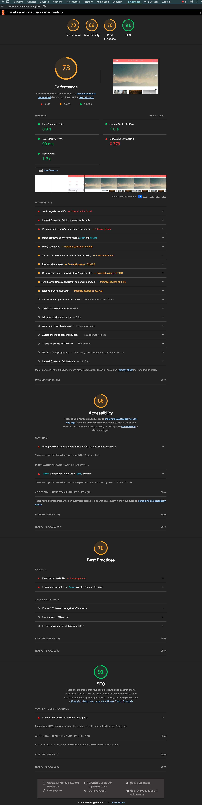

# E-Commerce Sample

## Picsum生成随机图片
Picsum: https://picsum.photos/
1. Download
```bash
curl -L https://picsum.photos/400/400 -o assets/product-x.png
```
2. Convert to .webp
```bash
cwebp -q 80 assets/product-x.png -o assets/product-x.webp
```

## 项目拆解
### 样式内容
#### 轮播图
首先明确，原生HTML+CSS实现轮播图的方式比较困难，这里我们讲如何用JS实现，同时对JS的一些特性进行一些前瞻。

1. DOM 元素获取
```javascript
const carousel = document.querySelector('.carousel');
const carouselItems = document.querySelectorAll('.carousel-item');
const prevButton = document.querySelector('.carousel-button.prev');
const nextButton = document.querySelector('.carousel-button.next');

let currentSlide = 0;
```

这部分代码获取了轮播图所需的所有 DOM 元素：

- carousel ：轮播图容器
- carouselItems ：所有轮播图项目的集合
- prevButton 和 nextButton ：上一张/下一张按钮
- currentSlide ：记录当前显示的幻灯片索引
2. 切换幻灯片的核心函数
```javascript
function showSlide(index) {
    carouselItems.forEach(item => item.classList.remove('active'));
    currentSlide = (index + carouselItems.length) % carouselItems.length;
    carouselItems[currentSlide].classList.add('active');
}
```
这个函数是轮播图的核心：

- 首先移除所有幻灯片的 'active' 类
- 计算新的索引位置： (index + carouselItems.length) % carouselItems.length
  - 加上 carouselItems.length 是为了处理负数索引（当点击"上一张"时）
  - 使用模运算 % 实现循环切换效果
- 给当前幻灯片添加 'active' 类使其显示

3. 事件监听器
```javascript
prevButton.addEventListener('click', () => showSlide(currentSlide - 1));
nextButton.addEventListener('click', () => showSlide(currentSlide + 1));

// 自动轮播
setInterval(() => showSlide(currentSlide + 1), 5000);
```
这部分设置了三种切换方式：

- 点击"上一张"按钮：显示索引减 1
- 点击"下一张"按钮：显示索引加 1
- 自动轮播：每 5 秒自动显示下一张
这个轮播图的实现方式比较简单直接，通过 CSS 的 active 类来控制显示/隐藏，通过 JavaScript 来处理索引计算和自动播放。要让这个轮播图正常工作，CSS 中还需要：

1. 设置 .carousel-item 的默认状态为隐藏
2. 设置 .carousel-item.active 为显示状态
3. 添加适当的过渡效果使切换更流畅

#### 图片瀑布流
```css
.products-grid {
    display: grid;
    grid-template-columns: repeat(auto-fill, minmax(280px, 1fr));
    gap: 2rem;
    padding: 2rem;
}

.product-card {
    background: var(--card-bg);
    border-radius: 8px;
    overflow: hidden;
    transition: transform 0.3s ease;
}

.product-card:hover {
    transform: translateY(-5px);
}

.product-image {
    width: 100%;
    height: 200px;
    object-fit: cover;
}

.product-info {
    padding: 1rem;
}
```
自适应列数方法: 
```
grid-template-columns: repeat(auto-fill, minmax(280px, 1fr));
```
- auto-fill ：自动填充列数，根据容器宽度决定显示多少列
- minmax(280px, 1fr) ：每列最小宽度 280px，最大可以占用 1 份剩余空间
- 这样设计可以让布局在不同屏幕尺寸下自动调整列数，保持视觉效果良好。
- 使用 gap 属性同时设置行和列的间距
- 比传统的 margin 方式更简洁且不会产生外边距折叠问题
3. 响应式布局 这种布局方式天然支持响应式：
- 在大屏幕上可能显示 4-5 列
- 在平板上可能显示 2-3 列
- 在手机上自动变为单列
4. 卡片样式
- 使用 overflow: hidden 确保图片不会溢出圆角边框
- 添加 transform 悬停效果增加交互体验
- 使用 object-fit: cover 确保商品图片填充指定区域且不变形

> 怎么实现网站主体切换和：hover交互效果之前项目实现过了，不赘述了。

#### PurgeCSS压缩CSS
1. 安装CLI工具：
````
npm i -g purgecss
````
2. 配置purgecss.config.js文件方法：
```javascript
module.exports = {
    content: [
        'index.html',
    ],
    css: ['styles/main.css']
}
```
````bash
purgecss --config ./purgecss.config.js
````
3. 直接运行purgecss命令：
````bash
purgecss --css styles/main.css --content index.html js/main.js --output build/main.min.css --safelist active dark
````
4. 替换预加载的CSS路径
```html
<link rel="preload" href="build/main.min.css" as="style">
<link rel="preload" href="js/main.js" as="script">
<link rel="stylesheet" href="build/main.min.css">
```

#### 图片懒加载
HTML 中已经使用了原生懒加载属性 loading="lazy" ，但我们可以进一步优化，添加渐进式加载效果：
```css
.product-image {
    width: 100%;
    height: 200px;
    object-fit: cover;
    opacity: 0;
    transition: opacity 0.3s ease-in-out;
}

.product-image.loaded {
    opacity: 1;
}
```
main.js中渐进式加载以及Intersection Observer的优化:
```javascript
// 创建观察器
const imageObserver = new IntersectionObserver((entries, observer) => {
    entries.forEach(entry => {
        if (entry.isIntersecting) {
            const img = entry.target;
            img.src = img.dataset.src;
            img.classList.add('loaded');
            observer.unobserve(img);
        }
    });
});

function createProductCard(product) {
    const card = document.createElement('div');
    card.className = 'product-card';
    card.innerHTML = `
        
        <div class="product-info">
            <h3 class="product-title">${product.title}</h3>
            <p class="product-price">${product.price}</p>
        </div>
    `;
    
    // 观察图片元素
    const img = card.querySelector('.product-image');
    imageObserver.observe(img);
    
    return card;
}
```
这种优化方案的优势：

1. WebP 格式可以显著减小图片体积（通常比 PNG 小 25-35%）
2. 原生懒加载属性确保基础的懒加载功能
3. 渐进式加载效果提供更好的用户体验
4. Intersection Observer 实现的懒加载更加高效，不会影响主线程性能
5. 图片加载失败时有优雅的降级处理

#### 关键渲染路径优化
````html 
<link rel="preload" href="build/main.min.css" as="style">
<link rel="preload" href="js/main.js" as="script">
````
异步加载非关键 JavaScript:
```html
<script src="js/main.js" defer></script>
````
- 使用 defer 属性延迟 JavaScript 的执行
- 避免 JavaScript 阻塞 DOM 解析

DOM 优化:

1. 减少重排重绘
```css
.product-card {
    transform: translateY(-5px);
    opacity: 0;
    transition: opacity 0.3s ease-in-out;
}
/* 使用 transform 代替位置属性 */
/* 使用 opacity 实现淡入效果 */

.products-grid {
    display: grid;
    grid-template-columns: repeat(auto-fill, minmax(280px, 1fr));
}
/* Grid 布局优化
使用现代布局系统
减少布局计算复杂度*/
```
2. 批量DOM操作
```javascript
products.forEach(product => {
    productsGrid.appendChild(createProductCard(product));
});
```

## 部署和验证
### Github Pages
上传到Github并利用Github Pages进行部署。
访问网站：https://shuheng-mo.github.io/ecommerce-home-demo/

### Lighthouse检测
- 打开 Chrome DevTools (Command + Option + I)
- 切换到 Lighthouse 面板
- 选择要检测的维度（Performance、Accessibility、SEO）
- 点击"Generate report",就可以获得以下页面报告，根据建议进行优化

优化完成后，再次运行 Lighthouse 检测，对比优化前后的分数。建议关注以下指标：

- FCP (First Contentful Paint)
- LCP (Largest Contentful Paint)
- CLS (Cumulative Layout Shift)
- TTI (Time to Interactive)